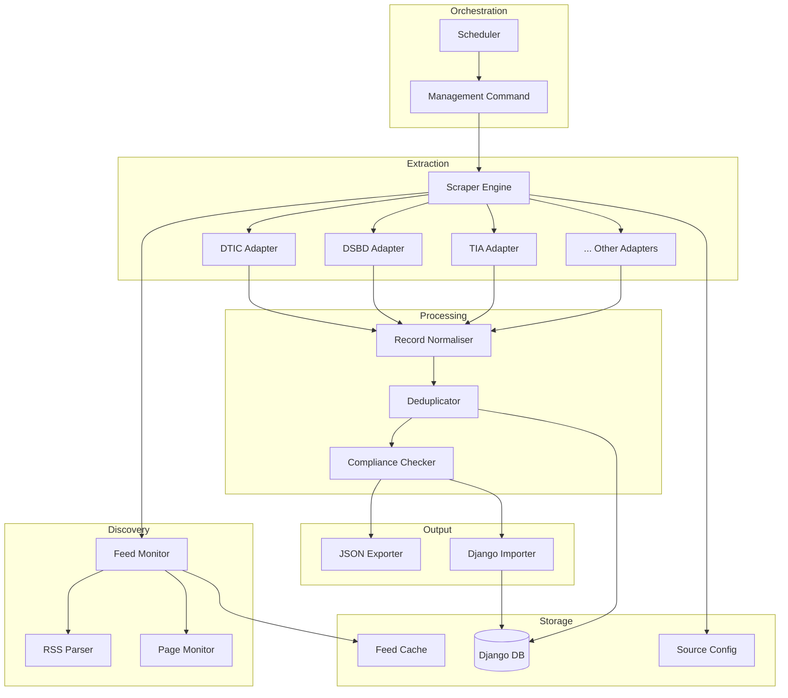
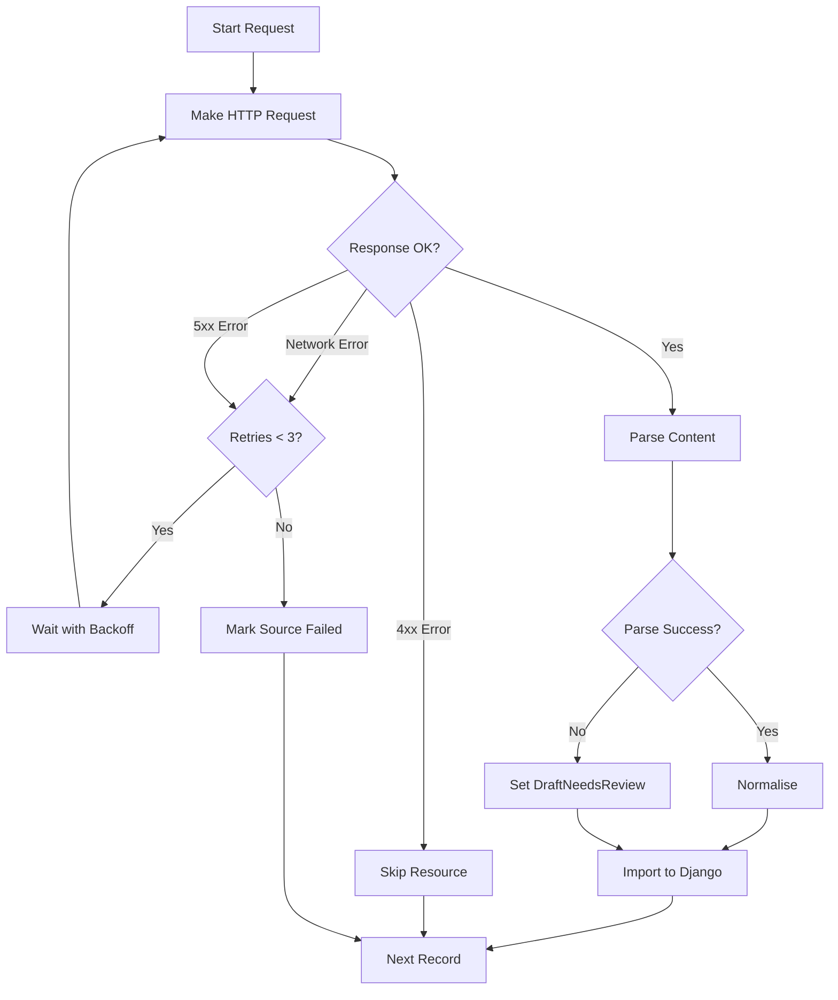

# Design Document: Grant Guide Scraper Engine

## Overview

The Grant Guide Scraper Engine is a modular web scraping system built as a Django application component. It follows a pipeline architecture where data flows through distinct stages: discovery → extraction → normalisation → deduplication → validation → import.

The system is designed with compliance as a first-class concern, implementing polite crawling practices and strict data validation. Each approved source has a dedicated adapter that understands the source's page structure, while shared components handle normalisation, deduplication, and Django integration.

Key design decisions:
- **Adapter Pattern**: Each source has a dedicated adapter class, allowing source-specific extraction logic while maintaining a common interface
- **Pipeline Architecture**: Data flows through discrete, testable stages
- **Fail-Safe Defaults**: When data is unclear, records are flagged for review rather than published with incorrect information
- **Django Integration**: Built as a Django app with management commands, leveraging existing models and infrastructure

## Architecture



### Component Responsibilities

1. **Management Command**: Entry point for running the scraper, handles CLI arguments
2. **Scraper Engine**: Orchestrates the scraping process across all sources
3. **Feed Monitor**: Discovers and monitors RSS feeds or news pages for changes
4. **Source Adapters**: Extract structured data from specific source websites
5. **Record Normaliser**: Transforms raw data into canonical format
6. **Deduplicator**: Identifies and merges duplicate records
7. **Compliance Checker**: Validates records against trust and safety rules
8. **Django Importer**: Maps normalised records to Django models and saves

## Components and Interfaces

### 1. Source Configuration

```python
@dataclass
class SourceConfig:
    """Configuration for an approved scraping source."""
    source_id: str                    # Unique identifier (e.g., "dtic")
    source_name: str                  # Display name (e.g., "the dtic")
    base_url: str                     # Base URL for the source
    scrape_urls: list[str]            # Specific URLs to scrape
    source_type: SourceType           # government/provincial/seta/corporate/international
    adapter_class: str                # Fully qualified adapter class name
    is_active: bool                   # Whether to include in scraping runs
    rate_limit_seconds: float         # Minimum delay between requests (default: 2.0)
    last_scraped: datetime | None     # Last successful scrape timestamp
    needs_attention: bool             # Flag for sources with repeated failures
    
class SourceType(Enum):
    GOVERNMENT = "government"
    PROVINCIAL = "provincial"
    SETA = "seta"
    CORPORATE = "corporate"
    INTERNATIONAL = "international"
```

### 2. Base Source Adapter Interface

```python
from abc import ABC, abstractmethod
from dataclasses import dataclass
from typing import Iterator

@dataclass
class RawOpportunity:
    """Raw extracted data before normalisation."""
    title: str | None
    funder_name: str | None
    funder_type: str | None
    funding_type: str | None
    description: str | None
    industries: list[str]
    provinces: list[str]
    business_stage: str | None
    eligibility: list[str]
    funding_amount_min: str | None
    funding_amount_max: str | None
    deadline: str | None
    is_rolling: bool
    required_documents: list[str]
    application_steps: list[str]
    apply_url: str | None
    source_url: str
    raw_html: str
    
class BaseSourceAdapter(ABC):
    """Abstract base class for source-specific adapters."""
    
    def __init__(self, config: SourceConfig, http_client: HttpClient):
        self.config = config
        self.http = http_client
        
    @abstractmethod
    def get_opportunity_urls(self) -> Iterator[str]:
        """Yield URLs of individual opportunity pages to scrape."""
        pass
    
    @abstractmethod
    def extract_opportunity(self, url: str, html: str) -> RawOpportunity:
        """Extract opportunity data from a page."""
        pass
    
    def scrape(self) -> Iterator[RawOpportunity]:
        """Main scraping method - iterates through opportunities."""
        for url in self.get_opportunity_urls():
            html = self.http.get(url)
            yield self.extract_opportunity(url, html)
```

### 3. Feed Monitor Interface

```python
@dataclass
class FeedItem:
    """Represents an item from an RSS feed or news page."""
    guid: str                # Unique identifier
    title: str
    url: str
    published_date: datetime | None
    
class FeedMonitor:
    """Monitors RSS feeds and news pages for new content."""
    
    def __init__(self, http_client: HttpClient, cache: FeedCache):
        self.http = http_client
        self.cache = cache
        
    def discover_feed(self, page_url: str) -> str | None:
        """Attempt to discover RSS feed URL from a page."""
        pass
    
    def get_new_items(self, source: SourceConfig) -> Iterator[FeedItem]:
        """Return items not previously seen."""
        pass
    
    def mark_seen(self, source_id: str, guid: str) -> None:
        """Mark an item as processed."""
        pass
```

### 4. Record Normaliser Interface

```python
@dataclass
class NormalisedOpportunity:
    """Fully normalised opportunity record."""
    record_type: RecordType           # FUNDING_OPPORTUNITY or FUNDING_PRODUCT
    title: str
    funder_name: str
    funder_type: FunderType
    funding_type: FundingType
    description_short: str            # Max 300 chars
    industry_tags: list[str]          # Canonical industry names
    province_tags: list[str]          # Canonical province names
    business_stage: BusinessStage
    eligibility_bullets: list[str]
    funding_amount_min: Decimal | None
    funding_amount_max: Decimal | None
    deadline_date: date | None
    is_rolling: bool
    required_documents_bullets: list[str]
    application_steps: list[str]
    official_apply_url: str
    source_url: str
    source_name: str
    last_verified_date: date
    status: OpportunityStatus
    raw_content_hash: str
    validation_issues: list[str]      # Issues found during normalisation

class RecordType(Enum):
    FUNDING_OPPORTUNITY = "A"  # Time-bound with deadline
    FUNDING_PRODUCT = "B"      # Rolling/always open

class FundingType(Enum):
    GRANT = "Grant"
    LOAN = "Loan"
    EQUITY = "Equity"
    MIXED = "Mixed"
    COMPETITION_PRIZE = "CompetitionPrize"

class OpportunityStatus(Enum):
    ACTIVE = "Active"
    EXPIRED = "Expired"
    DRAFT_NEEDS_REVIEW = "DraftNeedsReview"

class RecordNormaliser:
    """Transforms raw extracted data into normalised format."""
    
    CANONICAL_PROVINCES = [
        "Eastern Cape", "Free State", "Gauteng", "KwaZulu-Natal",
        "Limpopo", "Mpumalanga", "Northern Cape", "North West",
        "Western Cape", "National"
    ]
    
    CANONICAL_INDUSTRIES = [
        "Agriculture", "Construction", "Manufacturing", "Retail", "ICT",
        "Tourism", "Transport", "Energy", "Healthcare", "Education",
        "Creative", "Finance", "Mining", "Services", "Green Economy"
    ]
    
    def normalise(self, raw: RawOpportunity, source_name: str) -> NormalisedOpportunity:
        """Transform raw data to normalised format."""
        pass
    
    def normalise_amount(self, amount_str: str | None) -> Decimal | None:
        """Convert amount string to ZAR Decimal."""
        pass
    
    def normalise_date(self, date_str: str | None) -> date | None:
        """Convert date string to ISO date."""
        pass
    
    def normalise_province(self, province: str) -> str | None:
        """Map province to canonical name."""
        pass
    
    def normalise_industry(self, industry: str) -> str | None:
        """Map industry to canonical tag."""
        pass
```

### 5. Deduplicator Interface

```python
@dataclass
class DeduplicationResult:
    """Result of deduplication check."""
    is_duplicate: bool
    existing_record_id: int | None
    match_type: str | None            # "apply_url", "source_url", "fuzzy_title"
    similarity_score: float | None    # For fuzzy matches

class Deduplicator:
    """Identifies and handles duplicate records."""
    
    FUZZY_THRESHOLD = 0.85
    
    def __init__(self, db_session):
        self.db = db_session
        
    def check_duplicate(self, record: NormalisedOpportunity) -> DeduplicationResult:
        """Check if record already exists."""
        pass
    
    def fuzzy_match_title_funder(self, title: str, funder: str) -> DeduplicationResult:
        """Perform fuzzy matching on title+funder combination."""
        pass
```

### 6. Compliance Checker Interface

```python
@dataclass
class ComplianceResult:
    """Result of compliance validation."""
    is_compliant: bool
    issues: list[str]
    rejection_reason: str | None

class ComplianceChecker:
    """Validates records against trust and safety rules."""
    
    def check(self, record: NormalisedOpportunity) -> ComplianceResult:
        """Run all compliance checks."""
        pass
    
    def check_required_fields(self, record: NormalisedOpportunity) -> list[str]:
        """Check all required fields are present."""
        pass
    
    def check_url_validity(self, record: NormalisedOpportunity) -> list[str]:
        """Validate URLs are well-formed and accessible."""
        pass
    
    def check_no_payment_required(self, record: NormalisedOpportunity) -> list[str]:
        """Check for payment-to-apply indicators."""
        pass
```

### 7. Django Importer Interface

```python
@dataclass
class ImportResult:
    """Result of importing a record."""
    success: bool
    action: str                       # "created", "updated", "skipped"
    record_id: int | None
    error: str | None

class DjangoImporter:
    """Imports normalised records into Django database."""
    
    def import_record(self, record: NormalisedOpportunity) -> ImportResult:
        """Import a single record."""
        pass
    
    def import_batch(self, records: list[NormalisedOpportunity]) -> list[ImportResult]:
        """Import multiple records."""
        pass
    
    def map_to_model(self, record: NormalisedOpportunity) -> dict:
        """Map normalised record to FundingOpportunity model fields."""
        pass
    
    def get_or_create_industries(self, tags: list[str]) -> list[Industry]:
        """Get or create Industry records for tags."""
        pass
    
    def get_provinces(self, tags: list[str]) -> list[Province]:
        """Get Province records for tags."""
        pass
```

### 8. HTTP Client Interface

```python
class HttpClient:
    """HTTP client with rate limiting and robots.txt compliance."""
    
    def __init__(self, user_agent: str, default_delay: float = 2.0):
        self.user_agent = user_agent
        self.default_delay = default_delay
        self._robots_cache: dict[str, RobotFileParser] = {}
        self._last_request: dict[str, datetime] = {}
        
    def get(self, url: str, retry_count: int = 3) -> str:
        """Fetch URL with rate limiting and retries."""
        pass
    
    def is_allowed(self, url: str) -> bool:
        """Check if URL is allowed by robots.txt."""
        pass
    
    def get_crawl_delay(self, url: str) -> float:
        """Get crawl delay from robots.txt or use default."""
        pass
    
    def _enforce_rate_limit(self, domain: str) -> None:
        """Wait if necessary to respect rate limits."""
        pass
```

## Data Models

### Scraper Output Schema (JSON)

```json
{
  "$schema": "http://json-schema.org/draft-07/schema#",
  "type": "array",
  "items": {
    "type": "object",
    "required": [
      "record_type", "title", "funder_name", "funder_type", "funding_type",
      "description_short", "industry_tags", "province_tags", "business_stage",
      "eligibility_bullets", "is_rolling", "required_documents_bullets",
      "application_steps", "official_apply_url", "source_url", "source_name",
      "last_verified_date", "status", "raw_content_hash"
    ],
    "properties": {
      "record_type": {
        "type": "string",
        "enum": ["FundingOpportunity", "FundingProduct"]
      },
      "title": { "type": "string", "maxLength": 255 },
      "funder_name": { "type": "string", "maxLength": 255 },
      "funder_type": {
        "type": "string",
        "enum": ["government", "provincial", "seta", "corporate", "international"]
      },
      "funding_type": {
        "type": "string",
        "enum": ["Grant", "Loan", "Equity", "Mixed", "CompetitionPrize"]
      },
      "description_short": { "type": "string", "maxLength": 300 },
      "industry_tags": {
        "type": "array",
        "items": { "type": "string" }
      },
      "province_tags": {
        "type": "array",
        "items": {
          "type": "string",
          "enum": [
            "Eastern Cape", "Free State", "Gauteng", "KwaZulu-Natal",
            "Limpopo", "Mpumalanga", "Northern Cape", "North West",
            "Western Cape", "National"
          ]
        }
      },
      "business_stage": {
        "type": "string",
        "enum": ["Startup", "SME", "Established", "Any"]
      },
      "eligibility_bullets": {
        "type": "array",
        "items": { "type": "string" }
      },
      "funding_amount_min": { "type": ["number", "null"] },
      "funding_amount_max": { "type": ["number", "null"] },
      "deadline_date": {
        "type": ["string", "null"],
        "format": "date"
      },
      "is_rolling": { "type": "boolean" },
      "required_documents_bullets": {
        "type": "array",
        "items": { "type": "string" }
      },
      "application_steps": {
        "type": "array",
        "items": { "type": "string" }
      },
      "official_apply_url": { "type": "string", "format": "uri" },
      "source_url": { "type": "string", "format": "uri" },
      "source_name": { "type": "string" },
      "last_verified_date": { "type": "string", "format": "date" },
      "status": {
        "type": "string",
        "enum": ["Active", "Expired", "DraftNeedsReview"]
      },
      "raw_content_hash": { "type": "string", "pattern": "^[a-f0-9]{64}$" }
    }
  }
}
```

### Django Model Mapping

The scraper output maps to the existing `FundingOpportunity` model:

| Scraper Field | Django Model Field | Transformation |
|---------------|-------------------|----------------|
| title | funding_name | Direct |
| funder_name | funder | Direct |
| funding_type | funding_type | Lowercase enum value |
| description_short | description | Direct |
| industry_tags | industries (M2M) | Get/create Industry records |
| province_tags | provinces (M2M) | Get Province records |
| business_stage | business_stage | Lowercase enum value |
| eligibility_bullets | eligibility_requirements | JSON array |
| funding_amount_min/max | funding_amount | Format as range string |
| deadline_date | deadline | Direct date |
| is_rolling | is_rolling | Direct boolean |
| required_documents_bullets | required_documents | JSON array |
| application_steps | application_steps | JSON array |
| official_apply_url | apply_link | Direct URL |
| source_url | source_link | Direct URL |
| last_verified_date | last_verified | Direct date |
| status | status | Map to model choices |

### Source Configuration Storage

Source configurations are stored in a YAML file:

```yaml
# scraper/sources.yaml
sources:
  - source_id: dtic
    source_name: "the dtic"
    base_url: "https://www.thedtic.gov.za"
    scrape_urls:
      - "https://www.thedtic.gov.za/Incentives/"
    source_type: government
    adapter_class: "scraper.adapters.dtic.DTICAdapter"
    is_active: true
    rate_limit_seconds: 2.0
    
  - source_id: dsbd
    source_name: "DSBD"
    base_url: "https://www.dsbd.gov.za"
    scrape_urls:
      - "https://www.dsbd.gov.za/programmes"
    source_type: government
    adapter_class: "scraper.adapters.dsbd.DSBDAdapter"
    is_active: true
    rate_limit_seconds: 2.0
    
  # ... additional sources
```

### Feed Cache Schema

```python
# Stored in Django model or Redis
class FeedCacheEntry:
    source_id: str
    feed_url: str
    last_checked: datetime
    seen_guids: set[str]  # GUIDs of processed items
    etag: str | None      # For conditional requests
    last_modified: str | None
```


## Correctness Properties

*A property is a characteristic or behavior that should hold true across all valid executions of a system—essentially, a formal statement about what the system should do. Properties serve as the bridge between human-readable specifications and machine-verifiable correctness guarantees.*

### Property 1: Robots.txt Compliance

*For any* URL and its associated robots.txt file, the Scraper_Engine SHALL correctly parse all directives (User-agent, Disallow, Allow, Crawl-delay) and refuse to access any disallowed paths.

**Validates: Requirements 1.1**

### Property 2: Access Control Detection

*For any* HTML page containing login forms, paywall indicators, CAPTCHA challenges, or authentication requirements, the Scraper_Engine SHALL detect these patterns and skip the resource without attempting extraction.

**Validates: Requirements 1.2**

### Property 3: Rate Limiting Enforcement

*For any* sequence of requests to the same domain, the time between consecutive requests SHALL be at least 2 seconds (or the Crawl-delay specified in robots.txt, whichever is greater).

**Validates: Requirements 1.3**

### Property 4: Payment-to-Apply Rejection

*For any* opportunity description or page content containing payment requirement indicators (e.g., "application fee", "pay to apply", "registration fee required"), the Compliance_Checker SHALL reject the record.

**Validates: Requirements 1.6**

### Property 5: Social-Media-Only Rejection

*For any* record where the only contact method or application URL is a WhatsApp number, Telegram link, or social media page (without an official website), the Compliance_Checker SHALL reject the record.

**Validates: Requirements 1.7**

### Property 6: Approved Source Enforcement

*For any* URL not belonging to a configured approved source, the Scraper_Engine SHALL refuse to scrape it and log the rejection.

**Validates: Requirements 2.2**

### Property 7: RSS Feed Discovery

*For any* HTML page, the Feed_Monitor SHALL correctly identify RSS feed URLs from `<link rel="alternate" type="application/rss+xml">` tags, and when no such tag exists, SHALL test common RSS URL patterns.

**Validates: Requirements 3.1, 3.2**

### Property 8: Feed Item Deduplication

*For any* RSS feed item GUID that has been previously processed, the Feed_Monitor SHALL not trigger a re-scrape of that item.

**Validates: Requirements 3.5, 3.6**

### Property 9: Record Type Classification

*For any* extracted opportunity, if a specific deadline date exists, the record SHALL be classified as FundingOpportunity (Type A); if no deadline exists or the opportunity is explicitly rolling/always-open, it SHALL be classified as FundingProduct (Type B) with is_rolling=true.

**Validates: Requirements 4.1, 4.2, 4.3**

### Property 10: Missing Data Handling

*For any* extracted record where a required field (title, funder_name, funding_type, official_apply_url, source_url) cannot be extracted or mapped to a canonical value, the status SHALL be set to "DraftNeedsReview".

**Validates: Requirements 4.5, 5.6, 7.3**

### Property 11: Content Hash Computation

*For any* scraped page, the raw_content_hash SHALL be a valid SHA-256 hash of the page content, and the same content SHALL always produce the same hash.

**Validates: Requirements 4.6**

### Property 12: Description Truncation

*For any* description longer than 300 characters, the normalised description_short SHALL be exactly 300 characters ending with "..." (ellipsis).

**Validates: Requirements 4.7**

### Property 13: Currency Normalisation

*For any* monetary amount string (e.g., "R50,000", "50000 ZAR", "R 1 million"), the Record_Normaliser SHALL convert it to a numeric ZAR value.

**Validates: Requirements 5.1**

### Property 14: Date Normalisation

*For any* date string in common South African formats (e.g., "15 March 2025", "2025/03/15", "15-03-2025"), the Record_Normaliser SHALL convert it to ISO format (YYYY-MM-DD).

**Validates: Requirements 5.2**

### Property 15: Province Normalisation

*For any* province name or abbreviation (e.g., "GP", "Gauteng", "gauteng province", "KZN"), the Record_Normaliser SHALL map it to the canonical province name from the approved list.

**Validates: Requirements 5.3**

### Property 16: Industry Normalisation

*For any* industry reference (e.g., "tech", "Technology", "IT", "software"), the Record_Normaliser SHALL map it to one or more canonical industry tags from the approved list.

**Validates: Requirements 5.4**

### Property 17: Deduplication Priority

*For any* new record, the Deduplicator SHALL check for duplicates in this order: (1) exact match on official_apply_url, (2) exact match on source_url, (3) fuzzy match on title+funder_name with similarity >= 0.85.

**Validates: Requirements 6.1, 6.2, 6.3**

### Property 18: Duplicate Update Preservation

*For any* record identified as a duplicate, updating it SHALL preserve the original record ID and created_at timestamp while updating last_verified_date and other fields.

**Validates: Requirements 6.4, 6.5**

### Property 19: Expiry Status Management

*For any* record with deadline_date in the past (< today), the status SHALL be set to "Expired".

**Validates: Requirements 7.1**

### Property 20: Stale Rolling Record Detection

*For any* record with is_rolling=true and last_verified_date more than 60 days ago, the status SHALL be set to "DraftNeedsReview".

**Validates: Requirements 7.2**

### Property 21: Active Status Validation

*For any* record that has all required fields, valid URLs, a future or null deadline (for rolling), and passes all compliance checks, the status SHALL be set to "Active".

**Validates: Requirements 7.4**

### Property 22: Django Model Mapping

*For any* normalised record, the Django_Importer SHALL correctly map all fields to the FundingOpportunity model, including ManyToMany relationships for industries and provinces.

**Validates: Requirements 8.1, 8.6, 8.7**

### Property 23: Audit Log Creation

*For any* record created or updated by the Django_Importer, an AuditLog entry SHALL be created with the appropriate action ("created_by_scraper" or "updated_by_scraper") and changed fields.

**Validates: Requirements 8.2, 8.3**

### Property 24: Import Error Resilience

*For any* validation error during import, the Django_Importer SHALL log the error and skip the record without crashing, allowing subsequent records to be processed.

**Validates: Requirements 8.4**

### Property 25: JSON Output Compliance

*For any* scraper output, the JSON SHALL be a valid array where each record contains all required fields, unknown values are represented as null (not missing), and the output validates against the defined JSON schema.

**Validates: Requirements 9.1, 9.2, 9.3, 9.5**

### Property 26: Source Processing Isolation

*For any* error occurring while processing one source, the Scraper_Engine SHALL log the error and continue processing remaining sources without termination.

**Validates: Requirements 10.6**

### Property 27: Network Retry with Backoff

*For any* network error (timeout, connection refused, 5xx response), the HttpClient SHALL retry up to 3 times with exponential backoff (e.g., 1s, 2s, 4s delays).

**Validates: Requirements 11.1**

### Property 28: Parsing Error Resilience

*For any* parsing error or unexpected page structure, the Scraper_Engine SHALL log the issue, mark the source for review if appropriate, and continue processing without crashing.

**Validates: Requirements 11.2, 11.3**

### Property 29: Consecutive Failure Tracking

*For any* source that fails on 3 or more consecutive scraping runs, the Scraper_Engine SHALL set the needs_attention flag to true in the source configuration.

**Validates: Requirements 11.6**

## Error Handling

### Error Categories

| Category | Examples | Handling Strategy |
|----------|----------|-------------------|
| Network Errors | Timeout, connection refused, DNS failure | Retry 3x with exponential backoff, then skip source |
| HTTP Errors | 4xx, 5xx responses | 4xx: skip resource; 5xx: retry then skip |
| Access Denied | Login required, CAPTCHA, paywall | Skip resource, log as blocked |
| Parsing Errors | Missing expected elements, malformed HTML | Log warning, mark record as DraftNeedsReview |
| Validation Errors | Invalid URL, missing required field | Set status to DraftNeedsReview, continue |
| Database Errors | Constraint violation, connection lost | Log error, skip record, continue batch |

### Error Recovery Flow



### Logging Strategy

```python
# Log levels by operation type
LOGGING_CONFIG = {
    'scraper.http': 'INFO',      # Request/response summaries
    'scraper.parse': 'DEBUG',    # Detailed extraction steps
    'scraper.normalise': 'DEBUG', # Normalisation decisions
    'scraper.dedup': 'INFO',     # Duplicate detection results
    'scraper.import': 'INFO',    # Import results
    'scraper.error': 'ERROR',    # All errors
}

# Log format includes timestamp, source, and context
LOG_FORMAT = '%(asctime)s [%(levelname)s] %(name)s - %(message)s [source=%(source_id)s]'
```

## Testing Strategy

### Dual Testing Approach

The scraper engine requires both unit tests and property-based tests:

- **Unit tests**: Verify specific examples, edge cases, integration points
- **Property tests**: Verify universal properties across generated inputs

### Property-Based Testing Configuration

- **Library**: Hypothesis (Python)
- **Minimum iterations**: 100 per property test
- **Tag format**: `# Feature: grant-guide-scraper-engine, Property N: {property_text}`

### Test Categories

#### 1. Normalisation Tests (Property-Based)

```python
# Feature: grant-guide-scraper-engine, Property 13: Currency Normalisation
@given(amount=st.sampled_from([
    "R50,000", "R 50 000", "50000 ZAR", "R1 million", "R500k",
    "50,000.00", "R 1,500,000"
]))
def test_currency_normalisation(amount):
    result = normaliser.normalise_amount(amount)
    assert result is None or isinstance(result, Decimal)
    assert result is None or result >= 0
```

```python
# Feature: grant-guide-scraper-engine, Property 14: Date Normalisation
@given(date_str=st.sampled_from([
    "15 March 2025", "2025/03/15", "15-03-2025", "March 15, 2025",
    "15/03/2025", "2025-03-15"
]))
def test_date_normalisation(date_str):
    result = normaliser.normalise_date(date_str)
    assert result is None or isinstance(result, date)
    if result:
        assert result.isoformat() == "2025-03-15"
```

```python
# Feature: grant-guide-scraper-engine, Property 15: Province Normalisation
@given(province=st.sampled_from([
    "GP", "Gauteng", "gauteng", "GAUTENG", "Gauteng Province",
    "KZN", "KwaZulu-Natal", "kwazulu natal"
]))
def test_province_normalisation(province):
    result = normaliser.normalise_province(province)
    assert result in RecordNormaliser.CANONICAL_PROVINCES or result is None
```

#### 2. Deduplication Tests (Property-Based)

```python
# Feature: grant-guide-scraper-engine, Property 17: Deduplication Priority
@given(
    url1=st.urls(),
    url2=st.urls(),
    title=st.text(min_size=10, max_size=100),
    funder=st.text(min_size=5, max_size=50)
)
def test_deduplication_priority(url1, url2, title, funder):
    # Test that URL matching takes priority over fuzzy matching
    record = create_record(apply_url=url1, source_url=url2, title=title, funder=funder)
    result = deduplicator.check_duplicate(record)
    
    if result.is_duplicate:
        assert result.match_type in ["apply_url", "source_url", "fuzzy_title"]
```

#### 3. Compliance Tests (Property-Based)

```python
# Feature: grant-guide-scraper-engine, Property 4: Payment-to-Apply Rejection
@given(description=st.text().filter(
    lambda x: any(term in x.lower() for term in 
    ["application fee", "pay to apply", "registration fee", "payment required"])
))
def test_payment_rejection(description):
    record = create_record(description=description)
    result = compliance_checker.check(record)
    assert not result.is_compliant
    assert "payment" in result.rejection_reason.lower()
```

#### 4. Status Management Tests (Property-Based)

```python
# Feature: grant-guide-scraper-engine, Property 19: Expiry Status Management
@given(deadline=st.dates(max_value=date.today() - timedelta(days=1)))
def test_expired_status(deadline):
    record = create_record(deadline_date=deadline, is_rolling=False)
    status = determine_status(record)
    assert status == OpportunityStatus.EXPIRED
```

```python
# Feature: grant-guide-scraper-engine, Property 20: Stale Rolling Record Detection
@given(last_verified=st.dates(max_value=date.today() - timedelta(days=61)))
def test_stale_rolling_status(last_verified):
    record = create_record(is_rolling=True, last_verified_date=last_verified)
    status = determine_status(record)
    assert status == OpportunityStatus.DRAFT_NEEDS_REVIEW
```

#### 5. Integration Tests (Unit)

```python
def test_django_import_creates_audit_log():
    """Verify AuditLog is created when importing a new record."""
    record = create_valid_normalised_record()
    result = importer.import_record(record)
    
    assert result.success
    assert result.action == "created"
    
    audit = AuditLog.objects.filter(opportunity_id=result.record_id).first()
    assert audit is not None
    assert audit.action == "created_by_scraper"
```

```python
def test_source_error_isolation():
    """Verify one source failure doesn't stop other sources."""
    # Configure one source to fail
    sources = [
        create_source(id="good1", will_fail=False),
        create_source(id="bad", will_fail=True),
        create_source(id="good2", will_fail=False),
    ]
    
    results = engine.run(sources)
    
    assert results["good1"].success
    assert not results["bad"].success
    assert results["good2"].success  # Should still run
```

### Test Data Generators

```python
# Hypothesis strategies for generating test data
from hypothesis import strategies as st

opportunity_strategy = st.fixed_dictionaries({
    'title': st.text(min_size=10, max_size=255),
    'funder_name': st.text(min_size=5, max_size=255),
    'funding_type': st.sampled_from(['Grant', 'Loan', 'Equity', 'Mixed', 'CompetitionPrize']),
    'description': st.text(min_size=50, max_size=500),
    'industries': st.lists(st.sampled_from(CANONICAL_INDUSTRIES), min_size=1, max_size=5),
    'provinces': st.lists(st.sampled_from(CANONICAL_PROVINCES), min_size=1, max_size=3),
    'deadline': st.one_of(st.none(), st.dates(min_value=date.today())),
    'is_rolling': st.booleans(),
    'apply_url': st.from_regex(r'https://[a-z]+\.[a-z]+/[a-z]+', fullmatch=True),
    'source_url': st.from_regex(r'https://[a-z]+\.[a-z]+/[a-z]+', fullmatch=True),
})
```
